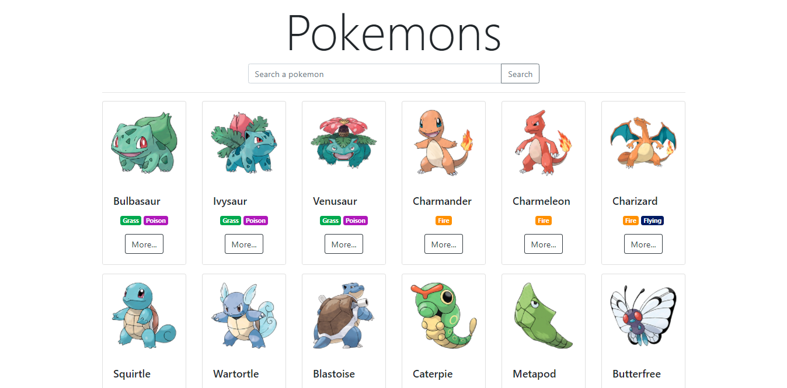

# APP-POKEDEX-V.1.0

Steps
- Migrate data json to mongo (i use mongo compas).
- Run folder "api", exec:
  - 1. `npm i`
  - 2. `npm run format`
  - 3. `npm start`
- access to swagger of API: `/api/docs`
- Run folder client: `npm start` this open window default index.html

